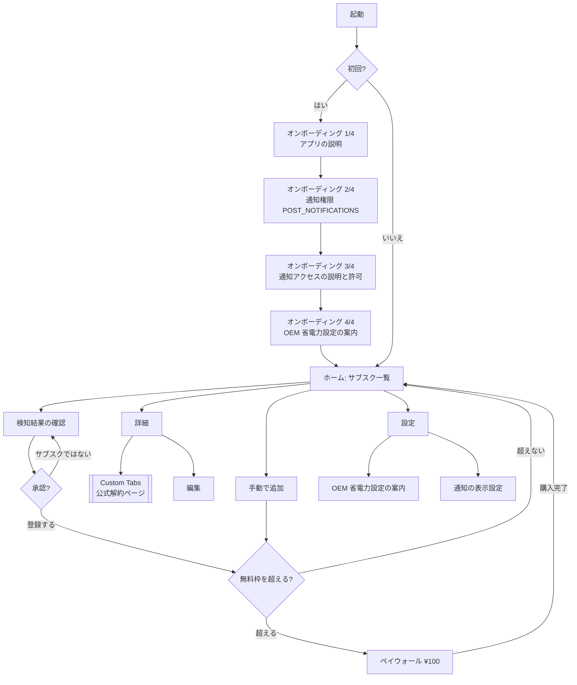

# アーキテクチャ

## 1. レイヤ構成

単方向依存。上の層は下の層を知っているが、逆はない。

```
ui (Jetpack Compose)
  ↓ 呼ぶ
domain (UseCase / モデル / 緊急度の算出)
  ↓ interface 越しに呼ぶ
data (Room / DataStore / Remote JSON / Billing)
```

`domain` は Android フレームワークに依存しない純 Kotlin にする。これは思想の問題ではなく実利で、
**このアプリで最もバグりやすい正規表現抽出と日付計算を、エミュレータなしの JVM テストで回せるようにするため**。

| パッケージ | 責務 |
|---|---|
| `ui.home` / `ui.detail` / `ui.entry` / `ui.detection` / `ui.onboarding` / `ui.paywall` / `ui.settings` | Compose 画面と ViewModel |
| `domain.model` | `Subscription`, `Urgency`, `Money`, `DetectionCandidate` |
| `domain.usecase` | `ScheduleRemindersUseCase`, `ConfirmDetectionUseCase`, `CanAddSubscriptionUseCase` ほか |
| `domain.detection` | **正規表現抽出エンジン（Android 非依存）** |
| `data.local` | Room DB、DAO、SQLCipher 設定、DataStore |
| `data.remote` | 解約URL DB の同期 |
| `data.notification` | `NotificationListenerService` 実装 |
| `data.billing` | Play Billing クライアント |
| `data.work` | WorkManager の Worker 群 |

## 2. モジュール分割

**Phase 1〜3 は単一モジュール `:app` で進める。**

マルチモジュール化は本来なら望ましいが、この規模で先に分割すると、ビルド設定の重複と
DI の配線が増えるだけで得るものが少ない。ただし将来の分離を可能にするため、
`domain.detection` だけは **Android 依存を一切持ち込まない**という規律を守る。
ここが `:core:detection` として切り出せる状態を維持しておけば、必要になった時点で分割できる。

分割を検討すべきタイミング: ビルド時間が体感で問題になったとき、または検知エンジンを
別アプリ・別プラットフォームで再利用する話が出たとき。

## 3. DI: Hilt

`NotificationListenerService` と `Worker` への注入方法が要注意。

- **Activity / ViewModel**: `@AndroidEntryPoint` / `@HiltViewModel` の標準構成。
- **`NotificationListenerService`**: `Service` のサブクラスなので `@AndroidEntryPoint` を付けられる。
  ただしこのサービスは **OS が任意のタイミングで起動する**ため、`Application` の初期化完了を前提にできない。
  重い初期化は `onListenerConnected()` に置き、コンストラクタ注入されたオブジェクトは遅延生成にする。
- **`Worker`**: `HiltWorkerFactory` を `Configuration.Provider` 経由で登録し、
  `@HiltWorker` + `@AssistedInject` を使う。**`WorkManager` の自動初期化を manifest で無効化**するのを忘れないこと
  （`androidx.startup` の `InitializationProvider` から `WorkManagerInitializer` を `tools:node="remove"` で除去）。
  ここは踏み忘れると実行時にクラッシュする定番の罠。

## 4. 依存バージョン候補

> ⚠️ **この表は未検証の候補値である。** 設計時の環境から Google Maven に到達できなかったため、
> 実測できていない。実装着手時に必ず [build-verification.md](build-verification.md) の手順で確定させ、
> この表を実測値で上書きすること。

| 項目 | 候補 | 備考 |
|---|---|---|
| JDK | 17+（開発機は 21） | AGP 8.x の要求 |
| Gradle | 8.14+ | AGP の要求下限に合わせる |
| AGP | 8.x 系の最新安定版 | Android Studio ウィザードの値を優先 |
| Kotlin | 2.x 系の最新安定版 | KSP・Compose Compiler と 1:1 対応 |
| KSP | Kotlin と完全一致する版 | `<kotlin版>-1.0.x` |
| Compose Compiler | `org.jetbrains.kotlin.plugin.compose` を Kotlin と同版で適用 | Kotlin 2.0 以降の方式 |
| compileSdk / targetSdk | **36** | |
| minSdk | **26** (Android 8.0) | 下記参照 |
| Compose | BOM で一括管理 | 個別バージョンを直書きしない |
| Room | 2.7+ | KSP を使う（KAPT は使わない） |
| Hilt | 2.5x 系 + `androidx.hilt:hilt-work` | |
| WorkManager | 2.10+ | |
| Play Billing | 7.x 以上 | `billing-ktx` |
| Custom Tabs | `androidx.browser:browser` 1.8+ | |
| DataStore | `datastore-preferences` 1.1+ | 購入状態のキャッシュ |
| SQLCipher | `net.zetetic:sqlcipher-android` 4.6+ | 旧 `android-database-sqlcipher` の後継 |
| Security | `androidx.security:security-crypto` | Keystore 由来のパスフレーズ保管 |
| JSON | `kotlinx-serialization-json` | 解約URL DB のパース |
| HTTP | OkHttp | ETag 制御が素直に書ける |

### minSdk 26 の根拠

- **通知チャネル (`NotificationChannel`) が API 26 で導入された。** 緊急度別に
  `reminder_urgent` / `reminder_normal` を分ける設計はチャネル前提であり、
  API 25 以下を支えると通知まわりが二重実装になる。
- **`java.time` が API 26 から使える。** 日付計算はこのアプリの中核であり、
  desugaring に頼らず標準 API を使えるほうが安全。
- API 26 未満の実機シェアは、日本・英語圏・中華圏のいずれでも実質的に無視できる水準。

## 5. 画面遷移



**設計上の注意**: オンボーディングの各ステップは**すべてスキップ可能**にする。
通知アクセスを拒否したユーザーでも、手動登録だけでアプリとして成立させる。
権限を必須にすると、拒否した瞬間にアンインストールされる。

## 6. 緊急度 (`Urgency`) の扱い

`Urgency`（SAFE / SOON / CRITICAL）は **DB に保存しない**。
`renewal_date` と現在時刻から毎回算出する。

```kotlin
// domain/model/Urgency.kt — Android 非依存
enum class Urgency { SAFE, SOON, CRITICAL }

fun urgencyOf(renewalAt: Instant, now: Instant): Urgency {
    val hoursLeft = Duration.between(now, renewalAt).toHours()
    return when {
        hoursLeft <= 3   -> Urgency.CRITICAL
        hoursLeft <= 24  -> Urgency.SOON
        else             -> Urgency.SAFE
    }
}
```

保存してしまうと時刻経過で必ず陳腐化し、「更新するための定期処理」という不要な複雑さを呼び込む。
算出コストはゼロに等しいので、常に導出する。

## 7. 一覧のクエリ

ソート UI を持たない設計なので、DAO は1本で足りる。

```kotlin
@Query("SELECT * FROM subscriptions WHERE is_active = 1 ORDER BY renewal_date ASC")
fun observeActive(): Flow<List<SubscriptionEntity>>
```

締切が近い順で固定。「登録順」「五十音順」といった選択肢は出さない —— 並び替えの自由より、
**開いたら一番上が一番危ない**という一貫性のほうが、このアプリでは価値が高い。
