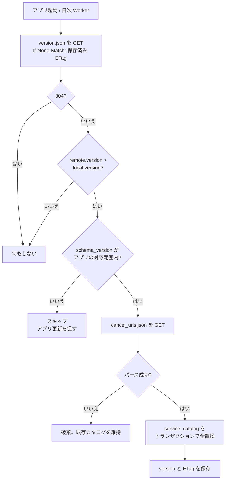

# 解約URLデータベース

`data/cancel_urls.json` は、このアプリで**最も価値が高く、最も腐りやすい**資産。
サービス名から解約ページへの対応表であり、検知パターンと監視パッケージも同居させている。

## 1. なぜ1つの JSON にまとめるか

サービスカタログ・検知パターン・監視パッケージは、更新のきっかけが同じ（新しいサービスへの対応）。
別ファイルに分けると同期漏れが起きるので、1ファイル1バージョンで管理する。
サイズは数百サービスでも数百 KB に収まり、分割する理由がない。

## 2. スキーマ

```jsonc
{
  "version": 3,                          // 単調増加。同期判定に使う
  "updated_at": "2026-08-07T00:00:00Z",
  "schema_version": 1,                   // 構造自体の版。アプリ側の互換判定に使う

  "services": [
    {
      "id": "netflix",                   // 一意・不変。変えると既存ユーザーの紐付けが切れる
      "names": {
        "en": "Netflix",
        "ja": "Netflix",
        "zh": "Netflix"
      },
      "regions": ["GLOBAL"],             // JP / US / CN / GLOBAL
      "cancel_url": "https://www.netflix.com/cancelplan",
      "cancel_url_overrides": {          // ロケール別に URL が違う場合のみ
        "ja": "https://www.netflix.com/jp/cancelplan"
      },
      "manual_steps": {                  // URL が存在しない場合の代替（アプリ内解約のみのサービス）
        "ja": ["アプリを開く", "設定 → 会員情報", "自動更新をオフにする"],
        "en": [...],
        "zh": [...]
      },
      "keywords": ["netflix", "ネットフリックス", "网飞", "奈飞"],
      "icon": "netflix",
      "verified": false,                 // 実際にアクセスして解約導線に着くことを確認したか
      "last_checked": null,              // "2026-08-07" 形式
      "notes": "解約導線は要ログイン。ログイン後 cancelplan に着く。"
    }
  ],

  "detection_patterns": [ /* → notification-detection.md */ ],
  "listener_packages": [ /* → notification-detection.md */ ]
}
```

### フィールドの規律

| フィールド | 規律 |
|---|---|
| `id` | **一度公開したら絶対に変えない。** ユーザーの `subscriptions.service_id` が参照している |
| `cancel_url` | **推測で埋めない。** 不明なら `null` にして `notes` に TODO を書く |
| `manual_steps` | `cancel_url` が `null` のサービス（アプリ内解約のみ）で必須 |
| `verified` | 人間が実際にアクセスして確認したら `true`。初期値は `false` |
| `regions` | ASO とオンボーディングのサジェスト順に使う |

## 3. 解約URLの選び方

**「解約導線に最短で着く公式ページ」を選ぶ。トップページで代用しない。**

| 良い例 | 悪い例 |
|---|---|
| `https://www.netflix.com/cancelplan` | `https://www.netflix.com/` |
| `https://account.adobe.com/plans` | `https://www.adobe.com/jp/` |

トップページに飛ばすと、ユーザーは解約メニューを自力で探すことになる。
それができるならこのアプリは要らない。**1タップで解約画面（またはその1つ手前）に着くこと**が要件。

### URL が存在しないサービス

中華圏のサービスと一部のモバイルアプリは、**Web に解約導線がなくアプリ内でしか解約できない**。
微信支付の自動扣費、支付宝の免密支付などが典型。

この場合は `cancel_url` を `null` にし、`manual_steps` に画面遷移の手順を入れる。
アプリ側は「解約ページを開く」ボタンの代わりに手順リストを表示する。

**適当な Web ページで代用しない。** 誤った URL は、このアプリで最悪のバグである
（ユーザーは解約したつもりで課金される）。

## 4. 検証の運用

**`verified: false` のまま公開しない。** リリース前に全件を人間が確認する。

確認手順:
1. URL を開く
2. ログインを求められる場合はログインし、実際に解約導線に着けるか確認する
3. 着けたら `verified: true`、`last_checked` に確認日を入れる
4. 着けなければ正しい URL を探すか、`null` + `manual_steps` に切り替える

**`last_checked` から6ヶ月以上経ったエントリは再確認の対象**とする。
サービス側のサイト改修で URL は静かに変わる。リダイレクトが残っていれば助かるが、
残っていない場合、ユーザーは 404 に飛ばされる。

> 本リポジトリの初版データは **すべて `verified: false`** である。
> 設計環境から各サービスへの到達性を確認できなかったため、URL は既知の値の記録にとどまる。
> リリース前検証は必須のタスクとして [roadmap.md](roadmap.md) の Phase 4 に入れてある。

## 5. 配信と同期

### ホスティング

このリポジトリの GitHub Raw をそのまま使う。サーバーもCDN契約も不要。

```
本体:     https://raw.githubusercontent.com/aiko-obara/subscCheck/main/data/cancel_urls.json
バージョン: https://raw.githubusercontent.com/aiko-obara/subscCheck/main/data/version.json
```

`version.json` は数十バイトの軽量ファイル。

```json
{ "version": 3, "schema_version": 1 }
```

### 同期ロジック



**設計上の要点**

- **まず `version.json` だけ取る。** 本体は数百 KB になり得るので、
  変更がないときに毎回落とすのは無駄。
- **ETag / `If-None-Match` を使う。** GitHub Raw は ETag を返す。
  304 が返れば通信量はヘッダのみで済む。
- **`schema_version` を先に見る。** 将来スキーマを壊す変更をしたとき、
  古いアプリが新しい JSON をパースして壊れるのを防ぐ。
  アプリは「自分が理解できる `schema_version`」を持ち、範囲外ならスキップする。
- **パース失敗時は既存カタログを維持する。** 壊れた JSON を push してしまったとき、
  全ユーザーのカタログが消えるのが最悪。**全置換はパース成功後、トランザクション内でのみ行う。**
- **同期はベストエフォート。** 失敗してもアプリは動く。フォールバックは
  「前回同期したカタログ」→「`assets/cancel_urls.json`（ビルド時同梱）」の順。

### assets への同梱

初回起動時、まだ一度も同期していない状態でもカタログが必要なので、
ビルド時に `data/cancel_urls.json` を `app/src/main/assets/` にコピーする。

```kotlin
// app/build.gradle.kts
val copyCatalog by tasks.registering(Copy::class) {
    from(rootProject.file("data/cancel_urls.json"))
    into(layout.projectDirectory.dir("src/main/assets"))
}
tasks.named("preBuild") { dependsOn(copyCatalog) }
```

リポジトリの1ファイルが唯一の情報源になり、手動コピーによるずれが起きない。

### 権限

同期には `android.permission.INTERNET` のみ。
**送信するデータは一切ない**（GET のみ、認証なし、識別子なし）。
これはデータ安全性フォームで「データを収集しない」と申告できることを意味する。

## 6. 初期収録サービス

地域別に、まず「無料トライアルを提供していて解約忘れが起きやすいもの」を優先する。

### 日本
Netflix、Amazon プライム、U-NEXT、Hulu Japan、DAZN、ABEMA プレミアム、dアニメストア、
Spotify、YouTube Premium、Google One、Adobe Creative Cloud、Microsoft 365、
Nintendo Switch Online、Kindle Unlimited、Audible

### 英語圏
Netflix、Amazon Prime、Disney+、Max、Hulu、Spotify、YouTube Premium、Google One、
Adobe Creative Cloud、Microsoft 365、Dropbox、Canva、Notion、Audible、
および Google Play / Apple のサブスク管理画面

### 中華圏
哔哩哔哩大会员、爱奇艺、腾讯视频、优酷、网易云音乐、QQ音乐、百度网盘、
微信支付の自動引き落とし解除、支付宝の免密支付解除

**中華圏のサービスは `cancel_url` が `null` になるものが多い**（アプリ内解約のみ）。
`manual_steps` を充実させることが、この地域での実用性を決める。
