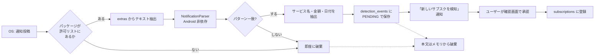

# 通知検知エンジン

このアプリの心臓部であり、**最も壊れやすい部分**でもある。各社の通知フォーマットは予告なく変わり、
言語ごとに表現が違う。設計の目標は「完璧に検知すること」ではなく、
**壊れたときに素早く直せる形にしておくこと**。

## 1. 全体の流れ



**破棄が既定の動作。** 一致しなかったテキストは即座に捨てる。

## 2. `NotificationListenerService`

```kotlin
@AndroidEntryPoint
class SubGuardNotificationListener : NotificationListenerService() {

    @Inject lateinit var pipeline: DetectionPipeline

    override fun onNotificationPosted(sbn: StatusBarNotification) {
        // 1. パッケージで足切り —— ここが最初かつ最重要のフィルタ
        if (!pipeline.isWatchedPackage(sbn.packageName)) return

        // 2. テキスト抽出
        val e = sbn.notification.extras
        val text = listOfNotNull(
            e.getCharSequence(Notification.EXTRA_TITLE),
            e.getCharSequence(Notification.EXTRA_TEXT),
            e.getCharSequence(Notification.EXTRA_BIG_TEXT),
            e.getCharSequence(Notification.EXTRA_SUB_TEXT),
        ).joinToString("\n") { it.toString() }

        // 3. 解析はバックグラウンドへ（onNotificationPosted はメインスレッド）
        pipeline.submit(sbn.packageName, text, sbn.postTime)
    }
}
```

### ライフサイクルの注意点

| 事象 | 挙動 | 対処 |
|---|---|---|
| ユーザーが権限を付与 | `onListenerConnected()` が呼ばれる | ここで初期化する。`onCreate` はサービス起動時で早すぎる |
| OS がサービスを再起動 | いつでも起こる | 状態をメモリに持たない。DB とカタログから毎回組み立てる |
| 権限が剥奪された | サービスが停止する | `NotificationManagerCompat.getEnabledListenerPackages()` で定期的に確認し、UI で警告を出す |
| メインスレッド | `onNotificationPosted` はメインスレッド | 正規表現の実行を絶対にここでやらない。ANR の原因になる |

**通知は1件のイベントで大量に飛んでくる**（アプリ起動時に既存通知が一斉に流れる）。
`onListenerConnected` の直後は特に多い。パッケージ足切りを最初に置くのはこのため。

### manifest

```xml
<service
    android:name=".data.notification.SubGuardNotificationListener"
    android:exported="false"
    android:permission="android.permission.BIND_NOTIFICATION_LISTENER_SERVICE">
    <intent-filter>
        <action android:name="android.service.notification.NotificationListenerService" />
    </intent-filter>
</service>
```

権限画面へは `Settings.ACTION_NOTIFICATION_LISTENER_SETTINGS` で飛ばす。
**この権限はランタイム権限ダイアログでは取れない。** 設定アプリの一覧から
ユーザー自身が SubGuard を探して有効化する必要があるため、オンボーディングでは
「設定画面のどこを押すか」を図で示す。ここでの離脱率が最も高い。

## 3. パッケージ許可リスト

全通知を舐めない。監視対象は `cancel_urls.json` の `listener_packages` で配信し、
アプリ更新なしで追加できるようにする。

| 地域 | 主な監視対象 |
|---|---|
| 共通 | `com.android.vending`（Google Play）、`com.paypal.android.p2pmobile` |
| 日本 | 各メガバンク、カード会社、キャリア決済、コード決済アプリ |
| 英語圏 | 主要銀行アプリ、決済サービス |
| 中華圏 | `com.tencent.mm`（微信）、`com.eg.android.AlipayGphone`（支付宝） |

**メッセージアプリ・SNS・メールクライアントは意図的に含めない。**
メールで届く決済通知を拾えれば検知率は上がるが、メール通知を読む権限は
プライバシー上の説明コストが跳ね上がり、ストア審査のリスクも上がる。
検知率とのトレードオフとして、**含めない**を選ぶ。

> 具体的なパッケージ名は端末・地域・アプリのバージョンで変わるため、
> `data/cancel_urls.json` を唯一の情報源とし、このドキュメントには列挙しない。

## 4. パターン定義

正規表現を Kotlin のコードに埋め込まず、**データとして持つ**。
理由は単純で、パターンが壊れるたびにアプリを再リリースするのは現実的でないから。

```json
{
  "id": "play_trial_start_ja",
  "locales": ["ja"],
  "packages": ["com.android.vending"],
  "kind": "TRIAL_START",
  "regex": "(?<service>.+?)\\s*の\\s*(?<trialDays>\\d+)\\s*日間(?:の)?無料(?:体験|トライアル)",
  "groups": { "service": "service", "trialDays": "trialDays" },
  "confidence": 0.9
}
```

| フィールド | 説明 |
|---|---|
| `id` | 一意。ユーザー報告で「どのパターンが動いたか」を特定するのに使う |
| `locales` | 適用する言語 |
| `packages` | 適用するパッケージ（空なら全許可パッケージ） |
| `kind` | `TRIAL_START` / `RENEWAL_NOTICE` / `PAYMENT_DONE` |
| `regex` | **名前付きキャプチャグループを使う。** 番号だと保守で必ず壊れる |
| `confidence` | 0.0〜1.0。低いものは確認画面での警告文を変える |

### 正規表現を書くときの規律

- **`.*` を先頭に置かない。** バックトラックで固まる。
- **必ず `RegexOption.IGNORE_CASE` と、中国語は簡体・繁体の両方を考慮。**
- **タイムアウトを持たせる。** Kotlin の `Regex` にタイムアウト機構はないので、
  解析はワーカースレッドで動かし、`withTimeout` で包む。悪意ある通知テキストによる
  ReDoS を、通知経由で他アプリから仕掛けられる余地を残さない。
- 1つのパターンで全部を取ろうとしない。**サービス名だけ / 金額だけ / 日付だけ**を
  取る小さなパターンを組み合わせる。

## 5. 金額のパース

3言語・3通貨で表記が大きく異なる。**通貨記号だけで通貨を決めない** —— `¥` は
日本円と人民元の両方で使われる。

| 入力例 | 出力 | 判定根拠 |
|---|---|---|
| `¥1,200` / `1,200円` / `1200 JPY` | `Money(1200, "JPY")` | `円` / `JPY` / 端末ロケール ja |
| `$9.99` / `USD 9.99` | `Money(999, "USD")` | `$` + `.` 2桁 |
| `12元` / `￥12.00` / `12.00 CNY` | `Money(1200, "CNY")` | `元` / `CNY` / 端末ロケール zh |
| `無料` / `free` / `免费` | `Money(0, <ロケール既定>)` | ゼロ円扱い |

**`¥` 単独の曖昧性の解決順**:
1. 同じテキスト内に `元` / `円` / ISO コードがあればそれに従う
2. 通知元パッケージの地域（支付宝 → CNY）
3. 端末のロケール
4. それでも不明なら **確認画面でユーザーに選ばせる**（推測で登録しない）

## 6. 日付のパース

絶対日付と相対表現の両方を扱う。

### 絶対日付

| 言語 | 例 |
|---|---|
| ja | `2026/09/01`、`2026年9月1日`、`9月1日` |
| en | `Sep 1, 2026`、`01/09/2026`、`2026-09-01` |
| zh | `2026年9月1日`、`2026-09-01` |

**`01/09/2026` は米国式（1月9日）と欧州式（9月1日）で意味が逆になる。**
ロケールで判定し、判定できなければ確認画面でユーザーに見せる。

### 相対表現

| 言語 | 例 | 算出 |
|---|---|---|
| ja | `3日間無料`、`初月無料`、`7日間の無料トライアル` | `通知受信時刻 + N日` |
| en | `7-day free trial`、`free for 30 days`、`first month free` | 同上 |
| zh | `首月免费`、`7天免费试用`、`免费试用7日` | 同上 |

`初月無料` / `first month free` / `首月免费` は **1ヶ月後**。
`Instant + 30日` ではなく `LocalDate.plusMonths(1)` を使う（月の長さが違うため）。

**タイムゾーンの扱い**: DB には UTC epoch millis で保存するが、
計算と表示は必ず端末のタイムゾーンで行う。`Instant` と `ZonedDateTime` を
混同すると、日付が1日ずれた通知が飛ぶ。これは実際に起こりやすい。

## 7. 誤検知への構え

**自動検知の結果を、直接 `subscriptions` に書き込まない。**

`confidence` が 0.99 でも同じ。理由は非対称なコストにある。

| 誤りの種類 | ユーザーへの影響 |
|---|---|
| **検知漏れ**（拾えなかった） | 手動登録すれば済む。不便だが回復可能 |
| **誤検知**（勝手に登録された） | 存在しないサブスクの通知が届く。アプリへの信頼が即座に失われる |

検知漏れより誤検知のほうが致命的なので、**必ず人間の確認を挟む**。
確認画面（→ UI モックアップ）では、抽出した各フィールドを編集可能にし、
`confidence` が低い場合は「日付が正しいか確認してください」という一文を追加する。

## 8. テスト戦略

正規表現エンジンは `domain.detection` に置き、**Android に一切依存させない**。
これにより、エミュレータなしの高速な JVM テストで回帰を担保できる。

```
app/src/test/resources/detection/
├── ja/
│   ├── play_trial_start.txt
│   ├── bank_payment_done.txt
│   └── ...
├── en/
└── zh/
```

各 fixture は「通知テキスト」と「期待される抽出結果」の組。

```kotlin
class NotificationParserTest {
    @ParameterizedTest
    @MethodSource("corpus")
    fun `extracts expected fields`(case: CorpusCase) {
        val result = parser.parse(case.packageName, case.text, case.receivedAt)
        assertThat(result).isEqualTo(case.expected)
    }
}
```

**必ず「一致してはいけない」ケースも入れる。** 通販の発送通知やニュース通知が
サブスクとして拾われないことを、明示的にテストする。誤検知のほうが致命的だから、
負のテストケースのほうが重要度が高い。

## 9. パターンが壊れたときの回復経路

各社の通知フォーマットは変わる。**変わることを前提に運用を設計する。**

1. アプリ内に「この通知が検知されませんでした」報告ボタンを置く。
2. 報告に含めるのは **パターンID・パッケージ名・ロケール・アプリバージョンのみ**。
   **通知本文は絶対に送らない。** 本文の送信は、このアプリのプライバシー方針と
   Play の通知アクセスポリシーの両方に反する。
3. 開発者は「どのパッケージで、どのロケールで、検知が失敗しているか」の集計を見て、
   実機で該当アプリの通知を再現し、パターンを修正する。
4. 修正したパターンを `data/cancel_urls.json` に push すれば、
   **アプリ更新なしで全ユーザーに配信される**（→ [cancel-url-database.md](cancel-url-database.md)）。

本文を送らないため調査は手間になるが、この制約は譲らない。
本文を集める設計にした時点で、このアプリはストア審査とユーザーの信頼の両方を失う。

> **報告の送信先について**: 「サーバーを持たない」方針との整合が必要。
> 初期リリースでは、報告ボタンを **メールクライアント起動（`ACTION_SENDTO`）** で実装し、
> 送信するかどうかをユーザーが最終判断する形にするのが最も単純かつ安全。
> 集計基盤が必要になった時点で、匿名の書き込み専用エンドポイントを検討する。
